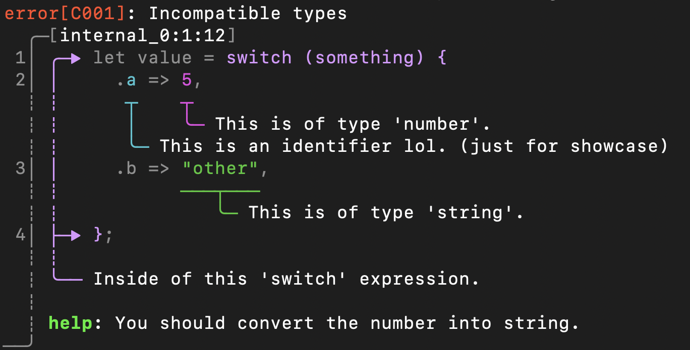

# Reportz

[]()
[]()
[]()
[]()

Reportz is a zig library for pretty error reporting.
It is inspired by rust's [ariadne](https://github.com/zesterer/ariadne) and [codespan](https://github.com/brendanzab/codespan) crates.

This library provides fancy diagnostic messages
that you can use in your custom compiler or interpreter project.

## Example



```zig
const example_diagnostic: lib.reports.Diagnostic = .{
    .source_id = "internal_0",
    .severity = .@"error",
    .code = "C001",
    .message = "Incompatible types",
    .labels = &.{
        lib.reports.Label{
            .color = .{ .basic = .bright_blue },
            .message = "Inside of this 'switch' expression.",
            .span = .{ .start = 12, .end = 66 },
        },
        lib.reports.Label{
            .color = .{ .basic = .magenta },
            .message = "This is of type 'number'.",
            .span = .{ .start = 43, .end = 44 },
        },
        lib.reports.Label{
            .color = .{ .basic = .cyan },
            .message = "This is an identifier lol. (just for showcase)",
            .span = .{ .start = 38, .end = 39 },
        },
        lib.reports.Label{
            .color = .{ .basic = .green },
            .message = "This is of type 'string'.",
            .span = .{ .start = 56, .end = 63 },
        },
    },
    .notes = &.{
        lib.reports.Note{ .message = "You should convert the number into string." },
    },
};

var source_cache = lib.cache.SourceCache.init(allocator);
defer source_cache.deinit();

try source_cache.addSource("internal_0",
    \\let value = switch (something) {
    \\    .a => 5,
    \\    .b => "other",
    \\};
);

var renderer = lib.Renderer{
    .allocator = allocator,
    .writer = &stdout_writer,

    .source_cache = &source_cache,
};
try renderer.render(&example_diagnostic);
```

## About

I've been interested in writing my own compilers
and interpreters for quite a long time now.
My go-to language for this was rust, but recently
I decided to try zig and I really liked It.

When making such projects, readable error messages are really important, and rust has many crates that
are designed to help you with this.
But for zig... it's a bit different.
The language does not have such great ecosystem
of libraries, so you often need to re-implement things yourself.

Amongst all my custom compiler projects in rust,
there was one library that stuck with me - `ariadne`.
A crate that allows you to print pretty error messages just like this one does.
So I hope you find this one useful.
There might be many edge-cases that are not handled properly, I do not guarantee I will fix them, but I will try.

## Features

- Inline and multi-line labels,
- A choice of character sets to ensure compatibility,
- Coloured labels & highlighting with 8-bit and rgb color support (24-bit ANSI might be added in the future),
- Automatic label ordering,
- Compact mode for smaller diagnostics (not yet),
- Correct handling of variable-width characters such as tabs (also todo),
- Notes to help user fix their issues,
- Built-in ordering heuristics that come up with the best way to avoid overlapping & label crossover.

Thanks to:

- `@zesterer` for making [`ariadne`](https://github.com/zesterer/ariadne) crate.
- `@brendanzab` for their [`codespan`](https://github.com/brendanzab/codespan) crate that allowed me to learn how this stuff works.
